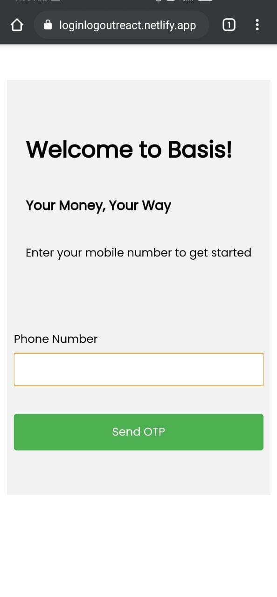
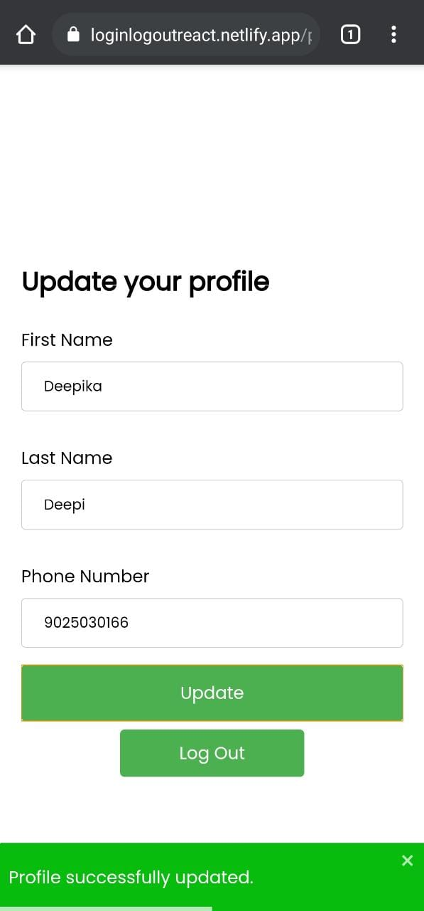

## How to run project locally

1. Download Code zip file and extract in a separate folder
2. Install dependencies using `npm install` command
3. Run `npm start` command in the project root directory to run the app.
4. App will run on [http://localhost:3000](http://localhost:3000)

## Features
1. Responsive - ✔️
2. LogIn - ✔️
3. LogOut - ✔️
4. SignUp - ✔️
5. Verify OTP and Resend OTP - ✔️
6. Verify Referral Token -✔️
7. Update Profile - ✔️
8. Reverts back to homepage if the token is mishandled more than 3 times - ✔️
9. Toast notification to user - ✔️
10. Protected Profile Route - ✔️
11. Forms Error handling - ✔️

## Missing Features 
1. Invite Url with Autofilling Code - ❌

## Tech Stack Used
1. React
2. Styled-components
3. React-Router
4. React-hook-form
5. React-toastify

## Missing Requirements
1. Redux

## Explanation
Since there are no deeply nested components which communicates from
different tree branches, there is simply no need for state management tool which adds lots of code for something which can be handled by `useState()`
and `useReducer()`.

In this entire app, I used `useState()` only once.

All the form state was handled by React-hook-form.

Due to the reason of not having any `GET` HTTP method, I simply have to
extensively use `localStorage` for saving the token and id, as handling it with
state will not be feasible, because when refreshed we lose all the important data.

For the UX part, I didn't disable any buttons for error handling as this will not communicate to the users about errors.

## Hosted App
Live app -> https://loginlogoutreact.netlify.app/ 

## Demo Image - Home View

## Demo Image - Profile View

